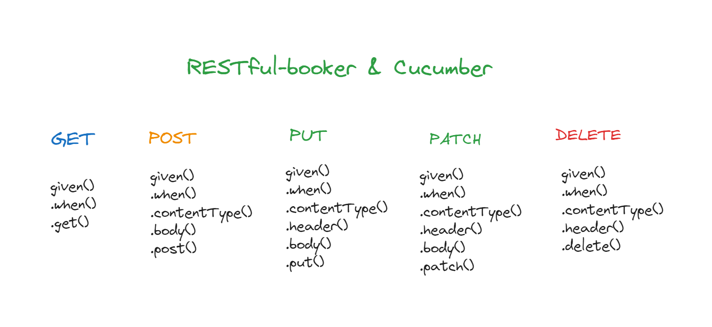
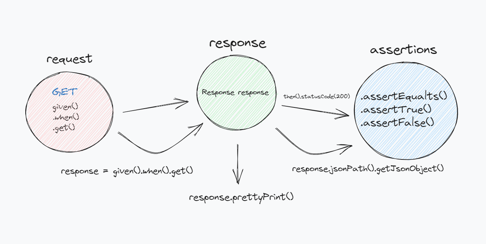
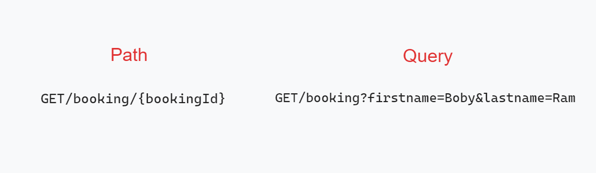
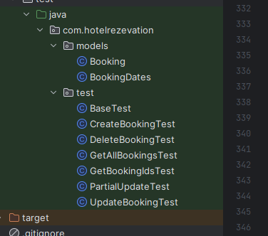
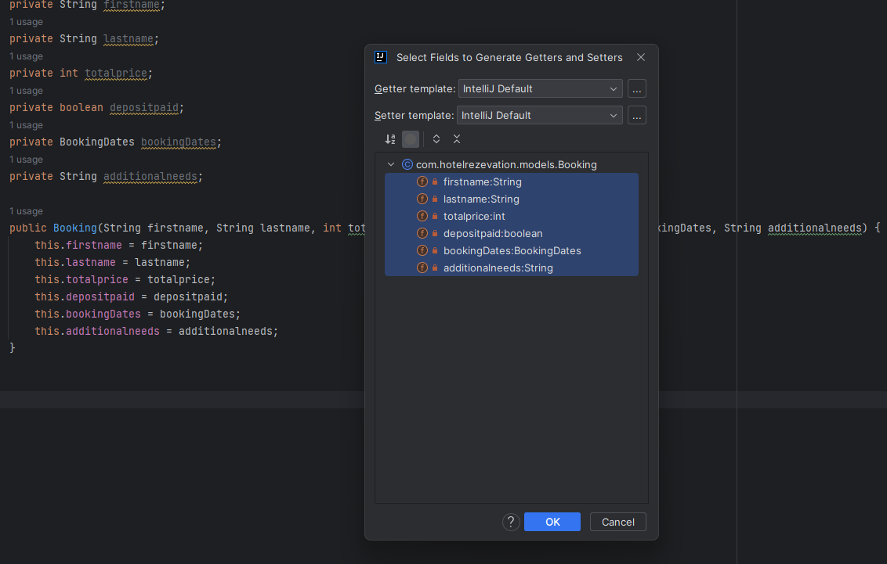

# *Rest Assured with Cucumber*

We will use Rest assured, Cucumber, Junit libraries and write a RESTful api automation project in java language. 
We will try to reduce code repetitions gradually and try to make a clean sample project as much as possible.

# *Restful-Booker*

## *Dependecies*

         <dependencies>
        <dependency>
            <groupId>io.rest-assured</groupId>
            <artifactId>rest-assured</artifactId>
            <version>5.3.1</version>
            <scope>test</scope>
        </dependency>
        <dependency>
            <groupId>org.junit.jupiter</groupId>
            <artifactId>junit-jupiter-api</artifactId>
            <version>5.10.0-M1</version>
            <scope>test</scope>
        </dependency>
        <dependency>
            <groupId>org.json</groupId>
            <artifactId>json</artifactId>
            <version>20230227</version>
        </dependency>
        <dependency>
            <groupId>com.fasterxml.jackson.core</groupId>
            <artifactId>jackson-databind</artifactId>
            <version>2.15.2</version>
        </dependency>
        <dependency>
            <groupId>io.cucumber</groupId>
            <artifactId>cucumber-java</artifactId>
            <version>7.12.1</version>
        </dependency>
        <dependency>
            <groupId>io.cucumber</groupId>
            <artifactId>cucumber-junit</artifactId>
            <version>7.12.1</version>
            <scope>test</scope>
        </dependency>
    </dependencies>

    The API test we will write consists of 3 stages;
    Request --> we create request with our given(), when(), get() methods
    Response --> We create an object of the Response class and assign the response here
    Assertions --> We write our controls to Response using assertion class methods

## __Auth__
### __Auth__ - [Create Token]

        curl -X POST \
            https://restful-booker.herokuapp.com/auth \
            -H 'Content-Type: application/json' \
            -d '{
            "username" : "admin",
            "password" : "password123"
        }'

    // curl -i https://restful-booker.herokuapp.com/booking
### Get Booking IDs
#### __(GET)__ [All Boking]

    @Test // ---> JUnit annotation for run test methods
    public void getAllBookingTest(){ // ---> API Test Method
        
        given()
                .when()
                .get("https://restful-booker.herokuapp.com/booking") //we assign our request with the get method, inside the method we write the request url as a string
                .then()
                .log().all() // With this method we can log our request
                .statusCode(200); //With this method we can check the status code of our request
    }
#### __(GET)__ [Boking By ID]

    @Test
    public void getBookingByIDTest(){

        Response response = given()     
                .when()
                .get("https://restful-booker.herokuapp.com/booking/182");
We create a response object from the Response class

        response = response.           
                .then()
                .statusCode(200);
We can call the details of response with this method

        response.prettyPrint();         

        String firstname = response.jsonPath().getJsonObject("firstname");  //We generate string objects and to check the values in the respone body
        String lastname = response.jsonPath().getJsonObject("lastname");       //We assign the keys and values in the body to this object
        int totalprice = response.jsonPath().getJsonObject("totalprice");
Using the assertEquals() method of the Assertions class

        Assertions.assertEquals("Josh",firstname);   
        Assertions.assertEquals("Allen",lastname);  // we check whether the values in the body are equal to the values we want.
        Assertions.assertEquals(111,totalprice);
    }

#### __(POST)__ Booking - [CreateBooking]

It is necessary to send a body for Booking

        curl -X POST \
            https://restful-booker.herokuapp.com/booking \
            -H 'Content-Type: application/json' \
            -d '{
            "firstname" : "Jim",
            "lastname" : "Brown",
            "totalprice" : 111,
            "depositpaid" : true,
            "bookingdates" : {
            "checkin" : "2018-01-01",
            "checkout" : "2019-01-01"
            },
            "additionalneeds" : "Breakfast"
        }'
Create a body

        JSONObject body = new JSONObject();
        body.put("firstname","Boby");
        body.put("lastname","Ram");
        body.put("totalprice",500);
        body.put("depositpaid",true);

There is a separate body in the JSON body, which is a json body with the name of the key in that body first.
and then replaces the value in the existing body.

We create the object that we will add to the body and fill in the key and value values.

        JSONObject bookingDates = new JSONObject();
        bookingDates.put("checkin","2023-07-05");
        bookingDates.put("checkout","2023-07-15");

        body.put("bookingdates", bookingDates);
        body.put("additionalneeds","Breakfast and Alcohol Services");

        Response response = given()
                .when()
                .contentType(ContentType.JSON)
                .body(body.toString()) //String bir tipe dönüştürmemiz lazım
                .post("https://restful-booker.herokuapp.com/booking");

Write Assertions
We call prettyPrint(); to see the call.
        
        response.prettyPrint();
        response
                .then()
                .statusCode(200);
        
        Assertions.assertEquals("Boby", response.jsonPath().getJsonObject("booking.firstname"));
        Assertions.assertEquals("Ram", response.jsonPath().getJsonObject("booking.lastname"));
        Assertions.assertEquals(500,(Integer)response.jsonPath().getJsonObject("booking.totalprice"));
Note: We need to convert the totalprice value to integer for control, for this it is enough to write (Integer) in front of the response

#### BaseTest Architecture
We have created a BaseTest class and we will get the necessary objects for our tests from this base test environment    
        
        @createBooking --> We create a method response with this method and use it in the test class
        @bookingObject --> We can get the body we filled in our post request with this string method

BaseTest Class extend test class

        BaseTest --> CreatBookingTest
        BaseTest --> GetBookingIdsTest
        BaseTest --> UpdateBookingTest
        BaseTest --> PartialUpdateTest
        BaseTest --> DeleteBookingTest

#### __(PUT)__ Booking-[UpdateBooking]
We need to create a token to send the request

    public String createToken(){
    
            JSONObject body = new JSONObject();
            body.put("username","admin");
            body.put("password","password123");
    
            Response response = given().contentType(ContentType.JSON)
                    .when()
                    .body(body.toString())
                    .log().all()
                    .post("https://restful-booker.herokuapp.com/auth");
    
            response.prettyPrint();
            
            return response.jsonPath().getJsonObject("token");
        }
We need to create a reservation and use its ID in the url

     String token = createToken();

        //Create a booking and assign its ID to the bookingID object
        Response createBookingObject = createBooking();
        int bookingId = createBookingObject.jsonPath().getJsonObject("bookingid");

create a request and fill in the booking information that we will update

        Response response = given()
                .contentType(ContentType.JSON)
                .header("Cookie","token="+token)
                .body(bookingObject())
                .put("https://restful-booker.herokuapp.com/booking/"+bookingId);

        response.prettyPrint();

we have created an update request but we have not made any changes to booking, 
so we need to parameterize the booking object method and this way we can update and test it

        @BaseTest
             protected String bookingObject(String firstname, String lastname, int totalPrice){

                JSONObject body = new JSONObject();
                body.put("firstname",firstname);
                body.put("lastname",lastname);
                body.put("totalprice",totalPrice);
                body.put("depositpaid",true);
             ...

We made firstname, lastname, totalprice values dynamic
We can update our reservation by filling in this information

         Response response = given()
                .contentType(ContentType.JSON)
                .header("Cookie","token="+token)
                .body(bookingObject("Test","User",1000))
                .put("https://restful-booker.herokuapp.com/booking/"+bookingId);
        response.prettyPrint();

Then add assterions and complete our test

        String firstName = response.jsonPath().getJsonObject("firstname");
        String lastName = response.jsonPath().getJsonObject("lastname");
        int totalprice = response.jsonPath().getJsonObject("totalprice");

        Assertions.assertEquals("Test",firstName);
        Assertions.assertEquals("User",lastName);
        Assertions.assertEquals(1000,totalprice);

#### __(PATCH)__ Booking - [PartialUpdateBooking]
If we are going to update only a certain part of the reservation, it is much better to use the patch 
http method. If you ask why, when we use the put method, we send the whole json object, but there is no need for that.
    

        String token = createToken();

        Response newBooking = createBooking();
        int bookingId = newBooking.jsonPath().getJsonObject("bookingid");

        JSONObject body = new JSONObject();
        body.put("firstname","Mahmut");

        Response response = given()
                .contentType(ContentType.JSON)
                .header("Cookie","token="+token)
                .body(body.toString())
                .patch("https://restful-booker.herokuapp.com/booking/" + bookingId);

        response.prettyPrint();

#### __(DELETE)__ Booking - [DeleteBooking]
first we need to generate a token and create a reservation
then we will send a delete request with the id of this reservation

        Response response = given()
                .when()
                .contentType(ContentType.JSON)
                .header("Cookie","token="+createToken())
                .when()                                                         // create booking
                .delete("https://restful-booker.herokuapp.com/booking/" + createBookingId());

        response.prettyPrint();
        response
                .then()
                .statusCode(201);

#### RequestSpecification 
Instead of writing urls into http methods and logging them separately, we can create a setUp method in 
the base test class, initalize the RequestSpecification, set the url and add a filter.
            
          --> in BaseTest
            @BeforeEach
            public void setUp(){
                spec = new RequestSpecBuilder()
                        .setBaseUri("https://restful-booker.herokuapp.com")
                        .addFilters(Arrays.asList(new RequestLoggingFilter(), new ResponseLoggingFilter()))
                        .build();
            }

We can avoid repeating ourselves in url and logging issues by writing the spec object we generate in the setup method into 
the given() method in the test classes we extend.
                    
                
                -->in GetBookingIdsTest Class

                     @Test
                     public void getAllBookingTest(){
                
                        given(spec)
                                .when()
                                .get("/booking")

                
                    @Test
                    public void getBookingByIDTest(){
                        Response response = given(spec)
                                .when()
                                .get("/booking/"+ createBookingId());
                
                        response
                                .then()
                                .statusCode(200);
                
                --> UpdateBookingTest
                    @Test
                    public void updateBookingTest(){
                        Response response = given(spec)
                                .when()
                                .contentType(ContentType.JSON)
                                .header("Cookie","token="+createToken())
                                .body(bookingObject("Test","User",1000,false))
                                .put("/booking/"+createBookingId());

### Path and Query Parameters

- Path params are used to define the dynamic data in the url path in rest api calls
- Query params are data sent in addition to the call request

            -->in GetAllBookingsTest Class

                    @Test
                    public void getBookingWithFirstNameFilter(){
                        int bookingId = createBookingId();
                
                        spec.queryParam("firstname","Boby");
                        spec.queryParam("lastname","Ram");
                
                        Response response = given(spec)
                                .when()
                                .get("/booking");
                
                        response
                                .then()
                                .statusCode(200);
                
                
                
                        List<Integer> filtedRezerve = response.jsonPath().getList("bookingid");
                
                        Assertions.assertTrue(filtedRezerve.contains(bookingId));
                    }

We can call our reservation by adding a queryParam to the spec object we previously created in baseTest.
In controlling our call, we generate an integer list and throw the booking ids in the response, we check with contains() 
and asertTrue method if the reservations we generate are in the list.            

### Serialization & POJO (Plain Old Java Object)

We will create pojo classes that we can generate reservations, keeping all classes under a 
single class will complicate the project, we can separate them into model and test.

Create Booking POJO class, booking object and booking attributes
        
            -->in models/Booking Class

                public class Booking {
                    private String firstname;
                    private String lastname;
                    private int totalprice;
                    private boolean depositpaid;
                    private BookingDates bookingDates;
                    private String additionalneeds;
                
                    public Booking(String firstname, String lastname, int totalprice, boolean depositpaid, BookingDates bookingDates, String additionalneeds) {
                        this.firstname = firstname;
                        this.lastname = lastname;
                        this.totalprice = totalprice;
                        this.depositpaid = depositpaid;
                        this.bookingDates = bookingDates;
                        this.additionalneeds = additionalneeds;
                    }
                

                }

After creating our booking objects and constructor method, let's create our getter and setter methods that we can work with these attributes

    
                  -->in models/Booking Class

                     public String getFirstname() {
                            return firstname;
                        }
                    
                        public void setFirstname(String firstname) {
                            this.firstname = firstname;
                        }
                    
                        public String getLastname() {
                            return lastname;
                        }
                    
                        public void setLastname(String lastname) {
                            this.lastname = lastname;
                        }
                     ..   
                     }
    
Now we will generate objects from pojo classes and write a test with them.
                    
                -->in CreateBookingTest Class

                    @Test
                    public void createBookingWithPojo(){
                        // rezervasyon tarihleri için bir nesne oluşturduk
                        // yeni bir rezervasyon oluşturmak için bir nesne oluşturduk ve içinde rezervasyon tarihi nesnesini yerleştirdik
                        BookingDates bookingDates = new BookingDates("20-07-2023","27-07-2023");
                        Booking booking = new Booking("Mahmut","Tuncer",500,false,bookingDates,"massage service");
                
                
                        Response response = given(spec)
                                .contentType(ContentType.JSON)
                                .body(booking)
                                .when()
                                .post("/booking");
                        response
                                .then()
                                .statusCode(200); 
                    }

#### Des Serialization
We use this method in test automation to reload test data, read data stored in files or receive data sent over the network

- Let's create a booking object via pojo classes and add booking information to this object
Since booking dates is a separate body, let's create a booking dates object from that clase and use this object to complete the reservation

        BookingDates bookingDates = new BookingDates("2023-07-20","2023-07-27");
        Booking booking = new Booking("Mahmut","Tuncer",500,false,bookingDates,"massage service");

- Then create a reservation request and place this booking object in the body method
        

         Response response = given(spec)
                .contentType(ContentType.JSON)
                .body(booking)
                .when()
                .post("/booking");

        response
                .then()
                .statusCode(200);

- Let's transfer our booking response to an object from the BookingResponse pojo class we created before by using the as() method

        BookingResponse bookingResponse = response.as(BookingResponse.class); //response u bir pojo nesnesi içerisinde tutuyoruz.
        System.out.println(bookingResponse + " response kaydedildi");

- Then write our assertions over our bookingResponse object and check our request

        Assertions.assertEquals("Mahmut",bookingResponse.getBooking().getFirstname());
        Assertions.assertEquals("Tuncer",bookingResponse.getBooking().getLastname());
        Assertions.assertEquals("massage service",bookingResponse.getBooking().getAdditionalneeds());    
